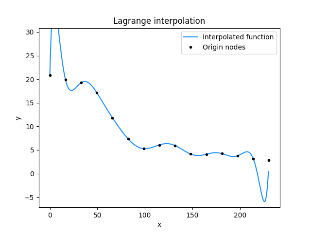
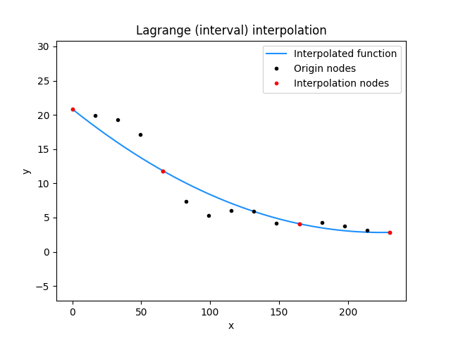
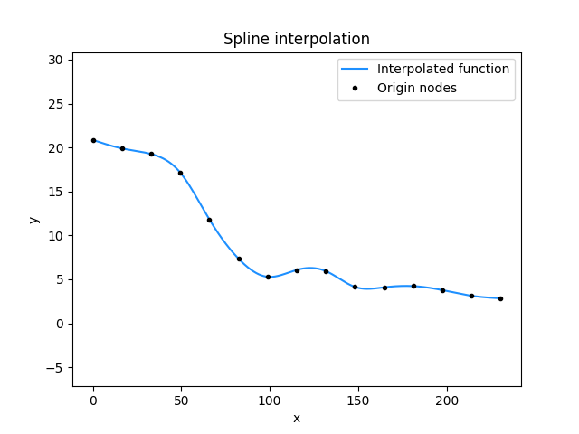

# Interpolation methods
Academic project made for analyzing the performance and effectiveness of selected interpolation methods. These ones mentioned below are using [LU decomposition](https://en.wikipedia.org/wiki/LU_decomposition) in order to calculate the linear systems.

## Usage
There are **two** projects implemented:
1. For calculating the solutions (C++)
2. For displaying them (Python3)

To make it work, the user must open the first project that is written in C++ and provide some input. Once the process is finished, the second project made in Python must be launched. Then the user is asked to choose a solution from the list to display the results.

## Used functions
### [Lagrange polynomial](https://en.wikipedia.org/wiki/Lagrange_polynomial)
Alternatively called "polynomial interpolation" is the simplest one to code. The goal is to build a function that has a degree equal to the given points amount. However, increasing the number of nodes worsens the interpolation. It is a well-known effect called [Runge's phenomenon](https://en.wikipedia.org/wiki/Runge%27s_phenomenon).

### [Splines](https://en.wikipedia.org/wiki/Spline_(mathematics))
A function made of fragments of the polynomials that are glued together. It is a remedy for Runge's phenomenon. Moreover, the quality of interpolation is excellent, but the downside is the complexity of operations to be performed.

## Example
### Lagrange interpolation
*Here you can see the Runge's phenomenon at the extremes.*

### Splines

## About technology
The code is written in C++, compatible with version 17 and higher, and Python3. 